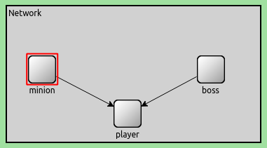
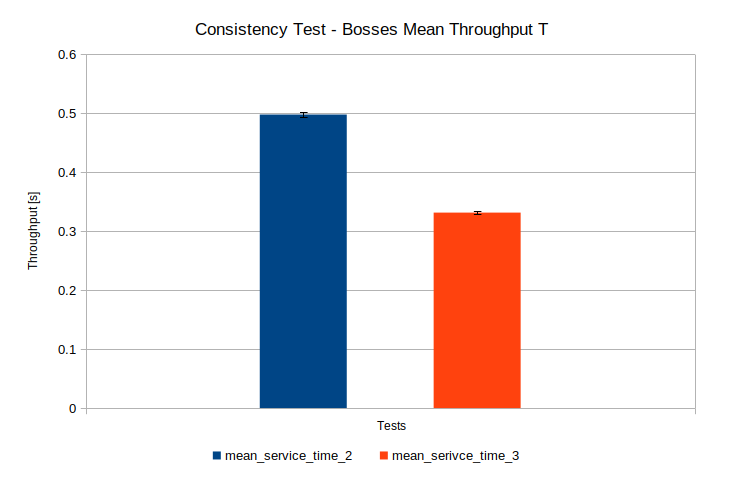
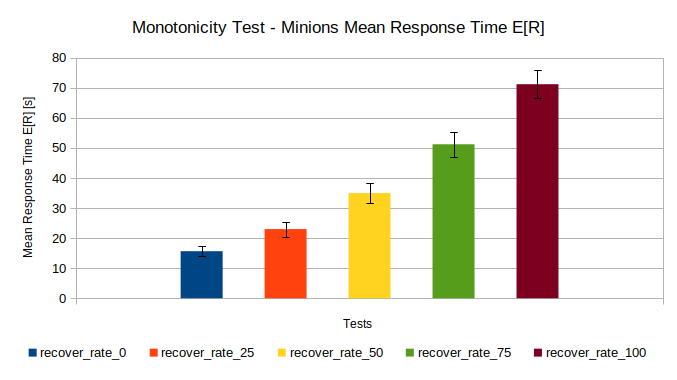
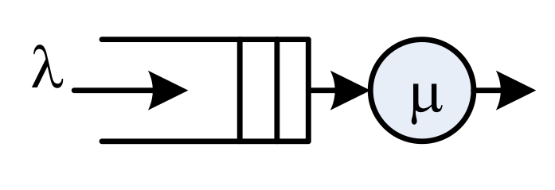
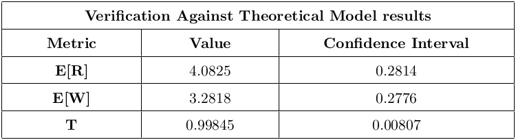

# Performance Evaluation of Secure Systems and Networks Project - Punch'em Videogame

University project for **Performance Evaluation of Computer Systems and Networks** course (MSc Computer Engineering at University of Pisa).

The project aimed to design, model, and implement a **system that simulates a fighting videogame** (called ***Punch'em Videogame***) and finally **evaluate the overall system performance** in different game scenarios.

The project was developed and tested using **Omnet++ 5.7 (on Ubuntu 20.04)**, while performance evaluation was studied through the production of graphs using spreadsheet software.
  

## Table of Contents
1. [Programming Languages and Tools](#programming-languages-and-tools) 
2. [Model Description and Implementation](#model-description-and-implementation)
    + [General Description](#general-description)
    + [Bosses and Minions](#bosses-and-minions)
    + [The Player](#the-player)
    + [Recovering System](#recovering-system)
3. [Objectives And KPIs](#objectives-and-kpis)
    + [Project Objective](#project-objective)
    + [KPIs (Key Performance Indexes)](#kpis-key-performance-indexes)   
4. [Verification](#verification)
5. [Factors Calibration](#factors-calibration)
6. [Simulation Experiments](#simulation-experiments)
7. [Conclusions](#conclusions)
  
  

## Programming Languages and Tools

    
  
    
    

  

## Model Description and Implementation

#### General Description
The system is modeled to reproduce a single player **punch’em videogame**, where there are two types of opponents, **Minions and Bosses**, sent by their respective bases to the **Player** that has to fight against them and try to defeat as much opponents as possible during a game.\
Moreover, boss type opponents have a **priority** on minions and when a boss arrives the fighting minion has to be queued up again recovering some life.
  

	

#### Bosses and Minions
The opponents, **sent respectively from the modules Boss and Minion** to the module Player, are **considered as messages** (new type defined, called ***OpponentMessage***) that are **placed in a FIFO queue** (different queues are used for each opponent type). The new type of opponent message has a parameter attached, the ***service time***, that is expressed in seconds and **represent the opponents life**.
  

#### The Player
An **opponent message** is extracted from the queue (start of the fight) and when the time corresponding to the latter’s life (service
time) runs out, the battle is declared finished and the opponent defeated.The player continues to fight against each opponent until the end of the game time (simulation time).
  

#### Recovering System
When a minion is under service and a boss arrives, the player stops the fight and perform the following operations:
1. **Takes off the minion** under service.
2. Computes the **percentage of the lost life**.
3. Takes the **“x” percentage of the lost life**, called **recovering percentage** ("x" is set in the configuration and can assume values 0 ≤ x ≤ 100 ).
4. Applies the recovering percentage to the current life, in order to compute the **life to be recovered**.
5. Sum up the current life and the life to be recovered.
6. Queue up the recovered minion again.
  

## Objectives and KPIs

#### Project Objective
The objective for the project is to **study the number of minion and bosses fought in the unit of time** as a function of the arrival rates of both types of opponents. Moreover, **study the queueing time** of both types of opponents.
  

#### KPIs (Key Performance Indexes)
- **Throughput *T***: Number of opponents defeated per unit of time (defeated opponents over seconds). Are considered two
different Throughput for each kind of opponent: ***Tm*** and ***Tb***.  

- **Mean Waiting Time *E[W]***: Is defined as the mean time between the arrival of an opponent (minion or boss) and its starting fight time.

- **Mean Response Time E[R]**: Is defined as the mean time between the arrival of an opponent (minion or boss) and its defeat time.
  

## Verification
In this section have been carried out several tests in order to verify **if the implementation reflects correctly the model**.

The tests performed are the following:
- **Deterministic and Simple Cases**: consists of performing tests with predicted (in this case constant) values for the interarrival and service time in order to study the behaviour for simple cases and check the correctness of the mathematical procedures. 
 
 	Specifically, were tested the correctness of the ***time of fights*** and ***minion recovery procedure***.
  

- **Degeneracy Test**: Has been verified the behaviour of the system with **parameters set to 0** (**interarrival and service times**).
  

- **Consistency Test**: Verified if the system react consistently with the output. In particular, has been verified across the ***Throughput T*** and the ***Mean Waiting Time E[W]*** analysis results. Following is shown an example on ***Throughput T results*** changing the opponents ***Mean Service Time***.
 	

		
	

  

- **Continuity Test**: The aim of this test is to verify if changing slightly the input affect slightly the output. Following is shown an example on ***Mean Response Time E[R] results*** changing the ***Recover Rate "x"***
 	

		
	

  

- **Verification Against the Theoretical Model**: The aim is to compare the output of a simplified version of our system against a theoretical model. 
  **Assumptions**:
    - There is **only one opponent type** (e.g. bosses) and **no recovering system**.
    -  **Exponential interarrival and service time**.

  The decision to have only bosses as opponent type lead us to discard the use of one of the two queues and then reproduce a ***M/M/1 system*** (queue + server) , where the **player is the “server”** and the **bosses are the “jobs”**.
	

		
	

    
    - **Theoretical Results obtained** (*System Utlization* **ρ**, *Mean number of jobs* **E[N]**, *Mean Response Time* **E[R]**, *Mean Waiting Time* **E[W]**, *Throughput* **T**)
    

      <strong> ρ = 0.8, E[N] = 4, E[R] = 4, E[W] = 3.2, T = 1 </strong>
    

     
    
    - **Simulation Results Obtained**:
    

    	
	

  

## Factors Calibration
The aim of this part is to fix the intervals of the factors to correctly reproduce the behaviour of the real system.

Specifically, there were calibrated the following system parameters (more details on the report):
- Bosses and Minions **Interarrival and Service Times**
- **Recover Rate "x" Factor**
- System **Warm-up Time**
- **Total Simulation Time**
  

## Simulation Experiments
It was decided to **divide the final simulation experiments into three different categories** (***easy, medium and hard games modes***), using an exponential distribution for mean service and arrival time in all three scenarios.

This part of the project presents the results obtained of a ***2kr Factorial Analysis*** and ***Simulation Experiments***.

- ***2kr Factorial Analysis***: This analysis was carried out with the aim of understanding the contribution of factors based on the results of minions and bosses KPIs. The analysis is made on both metrics to be analyzed, the ***Throughput T*** and the ***Mean Waiting Time E[W]*** (see more details and experiment results on the report).

- ***Simulation Experiments***: Experiments were performed with different ranges on ***interarrival time***, ***service time*** and ***recover rate "x"*** (see more details and experiment results on the report)
  

## Conclusions
The question we want to answer is, ***why is this study useful and which benefits can it give us?***
 

By studying the results, **average game experiences can be estimated**, predicting how a game might take place and which goals users would achieve by playing with different game modes.
 

Being able to **study the possible outcomes of a game in advance and set the basic parameters of the game** appropriately can **improve users performance** and, above all, their **level of satisfaction and fulfilment**, which **can be key factors in the success of a videogame**.

